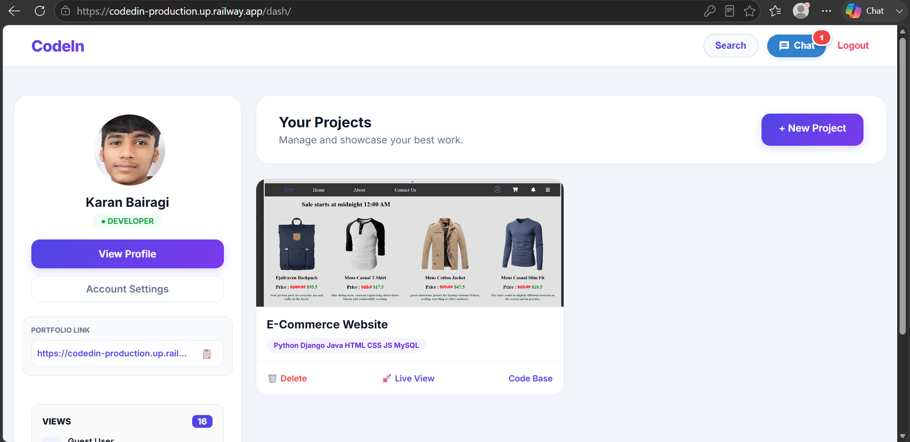
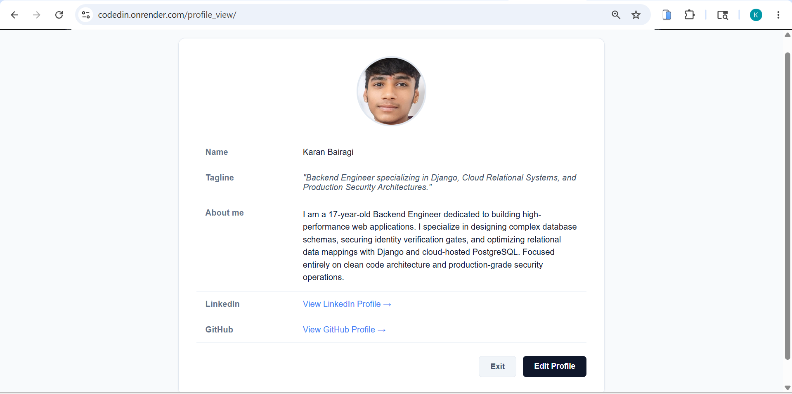

# 🚀 CodeIn — Developer Portfolio & Project Showcase Platform


### Build. Showcase. Grow as a Developer.

🌐 **Live Demo:** https://codein-omega.vercel.app/

---

## 📌 About CodeIn

CodeIn is a production-grade developer portfolio platform built with Django and cloud-hosted PostgreSQL. It enables developers to create public portfolios, manage projects, track profile analytics, and securely manage account identity inside one integrated platform.

The project focuses heavily on:
- Backend architecture
- Secure authentication systems
- Database integrity
- Production deployment workflows
- User account recovery systems

---

# 👨‍💻 About the Developer

Hi, I'm **Karan Bairagi**, a 17-year-old backend-focused developer from India.

In March 2025, after completing my 10th-grade exams, I moved to Hyderabad and joined Naresh i Technologies to focus completely on software development and Python Full Stack engineering.

CodeIn was built as a backend engineering challenge where I focused on:
- Authentication systems
- Database architecture
- ORM optimization
- Security validation
- Production deployment

💡 **Engineering Philosophy:**  
Rather than spending most of my time designing complex frontend layouts, I focused heavily on backend logic, relational database structure, authentication workflows, and production-level security operations. The complete backend system for CodeIn was engineered within 1 week as a practical challenge.

---

# 🛠️ The Tech Stack

| Technology Area | Stack Used |
|---|---|
| Backend Framework | Django 6.0 (Python 3.13) |
| Database Engine | Supabase (Cloud PostgreSQL) |
| Media Storage | Cloudinary |
| Deployment Platform | Render |
| Authentication | Django Auth System |
| Security | PBKDF2 Password Hashing + Secure Tokens |
| ORM | Django ORM |
| File Handling | Django Media & Cloudinary |

---

# ✨ Core Features

## 👤 Authentication & Security System

- Multi-step authentication and registration workflow
- Secure password hashing using Django PBKDF2 hashers
- Protected account routes using `@login_required`
- Secure password recovery system
- Security question-based identity verification
- 12-character secure recovery token generation using Python `secrets`
- Automatic 10-minute token expiration handling
- Manual account recovery support system through Support Tickets

---

## 🧑‍💻 Developer Profile Ecosystem

- Dynamic developer profile pages
- Profile image uploads
- Taglines and markdown-style bios
- GitHub and LinkedIn profile integration
- Public / Private profile visibility toggle
- Instagram-style private profile lock interface

---

## 📦 Project Showcase System

- Add and manage project repositories
- Tech stack tagging system
- Live project and source code links
- Secure image uploads using `accept="image/*"`
- Full CRUD operations restricted to account owners

---

## 🔍 Smart Search Architecture

- Real-time developer profile search
- Username, name, and tagline matching
- Implemented using advanced Django ORM `Q` expressions

---

## 👀 Visitor Analytics System

- Unique profile visitor tracking
- Repository view monitoring
- Timestamp-based analytics storage

---

# 🎨 Advanced UX Interactivity & State Management

To mirror production-grade user experience, CodeIn implements an optimized client-side state machine using native JavaScript to eliminate duplicate operations and manage slow network latency.

### 🔷 Hybrid Loading Architecture
- **Full-Screen App Loaders (`display: flex`)**: Triggered globally on core state transitions like secure account logouts or deep dashboard state changes to explicitly signal background processes to the user.
- **Inline Component Spinners (`innerHTML`)**: Injected natively inside granular action components (e.g., Form Submissions, Password Reset requests) to keep interaction localized without breaking the UI flow.

### 🔷 Double-Submission Prevention Strategy
- Triggered immediately on form `'submit'` events.
- Intercepts form nodes, injects an explicit CSS-animated `<span class="loading-spinner"></span>` wrapper, and sets `element.disabled = true`.
- Freezes critical boundary interactions to protect the Django backend from duplicate database entries or overlapping atomic POST transactions.

### 🔷 BFCache (Back-Forward Cache) Restoration Rule
Multi-page applications natively suffer from the hardware BFCache freeze pattern where clicking the hardware back button (`<`) serves a stateful memory snapshot—leaving loaders permanently stuck or buttons frozen. CodeIn bypasses this via memory tracking:
- Registers a global boundary listener on the **`pageshow`** event context.
- Isolates browser state flags via **`event.persisted`** to check if the DOM tree was served out of memory cache.
- Forrupted state trees are instantly unmounted, clearing inline loader markup, and reverting button interaction flags back to `disabled = false`.

---


# 🛡️ Global Exception & Routing Architecture (404 & 500)

To handle edge cases where a user alters URLs manually (e.g., trying to access non-existent Project IDs) or when an atomic backend transaction crashes, CodeIn overrides Django's default server errors with responsive, custom-designed templates.

### 🔷 Configure Handlers in Main `urls.py`
Add these directives at the absolute bottom of your primary routing configuration:
```python
handler404 = 'app.views.error'
handler500 = 'app.views.error500'
```

### 🔷 Production Fallback Verification
Django renders custom error nodes exclusively under production constraints. Update your environment state inside `settings.py`:
```python
DEBUG = False
ALLOWED_HOSTS = ['*']  # Permits local environment fallback testing
```

---

# 🔐 Advanced Form Validation

Custom validation systems built inside `forms.py` to protect database integrity and improve account security.

---

## 🔹 Username Validation

- Restricts whitespace and invalid special characters
- Prevents repeated periods
- Username length boundary validation
- Duplicate account prevention

---

## 🔹 Password Validation

- Requires:
  - Uppercase letters
  - Lowercase letters
  - Numbers
  - Special characters
- Blocks common weak passwords

---

## 🔹 Email & Mobile Validation

- Indian mobile number regex validation
- Invalid pattern suppression
- Duplicate sequence prevention
- Trusted email provider validation

---

# 📂 Database Schema Design

## 🔷 UserProfile

Stores:
- Full name
- Profile image
- Tagline
- Bio
- Social links
- Public/private visibility
- Profile analytics
- Security questions & answers

---

## 🔷 ProjectCard

Stores:
- Project title
- Tech stack tags
- Repository links
- Live URLs
- User relation via ForeignKey

---

## 🔷 ProfileVisitor

Tracks:
- Profile visits
- Viewer relationships
- Automatic timestamps using `auto_now_add`

---

## 🔷 SupportTicket

Handles:
- Manual account recovery requests
- User verification workflow
- Admin-side validation notes
- Ticket status tracking

---

# ⚙️ Local Installation

## 1️⃣ Clone Repository

```bash
git clone https://github.com/karanbairagivaidik57-web/CodedIn.git
cd CodedIn
```

## 2️⃣ Create Virtual Environment

```bash
python -m venv env
```

### Windows
```bash
env\Scripts\activate
```

### Linux / Mac
```bash
source env/bin/activate
```

---

## 3️⃣ Install Dependencies

```bash
pip install -r requirements.txt
```

---

## 4️⃣ Run Database Migrations

```bash
python manage.py makemigrations
python manage.py migrate
```

---

## 5️⃣ Start Development Server

```bash
python manage.py runserver
```

---

# 🚀 Production Deployment

CodeIn uses environment variables to securely separate sensitive credentials from source code.

### Required Environment Variables

| Variable | Value |
|---|---|
| DJANGO_SECRET_KEY | Your production secret key |
| DEBUG | False |
| DB_NAME | Supabase database name |
| DB_USER | Supabase postgres user |
| DB_PASSWORD | Database password |
| DB_HOST | Supabase host |
| DB_PORT | 5432 |
| CLOUD_NAME | Your Cloudinary cloud name |
| CLOUD_API_KEY | Your Cloudinary API key |
| CLOUD_API_SECRET | Your Cloudinary API secret |

---

# 📸 Project Preview

### 🖥️ Developer Dashboard


### 🧑‍💻 User Profile View



---

# 📜 Connect With Me

- GitHub: https://github.com/karanbairagivaidik57-web
- LinkedIn: https://www.linkedin.com/in/karan-bairagi/

---

# ⭐ Support

If this project inspired your backend development journey, feel free to leave a ⭐ on the repository.