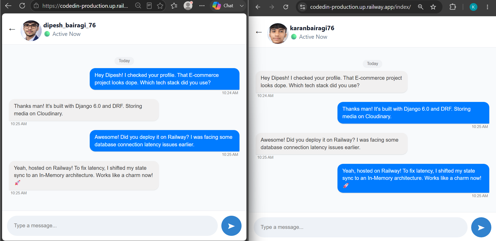

# 🚀 CodeIn — Developer Portfolio & Real-Time Developer Networking Platform


### Build. Showcase. Connect. Grow as a Developer.

🌐 **Live Demo:** https://codedin-production.up.railway.app/

---

# 📌 About CodeIn

CodeIn is a developer ecosystem built with Django that allows developers to create professional portfolios, showcase projects, track profile analytics, and communicate through a real-time messaging system.

The platform combines:

- Secure authentication workflows
- Cloud PostgreSQL database architecture
- Developer profile management
- Project showcase system
- Real-time WebSocket communication
- Analytics tracking

The project focuses on:

- Backend engineering
- Database architecture
- Real-time asynchronous systems
- Security implementation
- Production deployment workflows

---

# 👨‍💻 About the Developer

Hi, I'm **Karan Bairagi**, a 17-year-old backend-focused developer from India.

In March 2025, after completing my 10th-grade exams, I moved to Hyderabad and joined Naresh i Technologies to focus completely on software development and Python Full Stack engineering.

CodeIn was built as a backend engineering challenge where I focused on:

- Authentication architecture
- Database design
- ORM optimization
- Security validation
- Real-time communication systems
- Cloud deployment workflows

💡 **Engineering Philosophy**

Instead of only focusing on UI development, I concentrated on backend logic, relational database structures, authentication flows, security systems, and scalable application architecture.

---

# 🚀 Project Evolution

## CodeIn v1.0 → CodeIn v2.0


CodeIn started as a developer portfolio and project showcase platform.

With version 2.0, the platform evolved into a real-time developer networking system by introducing asynchronous communication architecture.

| Version | Focus |
|---|---|
| v1.0 | Profiles, Projects, Authentication, Analytics |
| v2.0 | WebSockets, Chat Engine, Presence Tracking, Real-Time Events |


The v2.0 upgrade explores modern application concepts:

- Persistent WebSocket connections
- Event-driven communication
- Real-time state synchronization
- Monolithic In-Memory Architecture (Optimized for 10-15 active users)


---

# 🛠️ Technical Stack

| Technology Area | Stack Used |
|---|---|
| Backend Framework | Django 6.0 (Python 3.13) |
| Async Communication | Django Channels |
| Front-end Core APIs | Web Speech API (Native Speech-to-Text) |
| Application Server | ASGI + Daphne |
| Message Broker | In-Memory RAM Architecture (Zero-Dependency) |
| Database | Supabase PostgreSQL |
| API Layer | Django REST Framework |
| Media Storage | Cloudinary |
| Authentication | Django Authentication System |
| ORM | Django ORM |
| Deployment | Railway |

---

# ⚡ CodeIn v2.0 — Real-Time Architecture


## 💬 Real-Time Messaging Engine


CodeIn uses WebSocket-based communication instead of traditional request-response messaging.


Traditional Django:

```
Client

↓

HTTP Request

↓

Server Response
```


Real-Time Architecture:

```
Client

↓

WebSocket Connection

↓

Django Channels Consumer

↓

In-Memory RAM Layer (Fast Pipeline)

↓

Connected Users
```


Features:

- Instant message delivery
- Room-based conversations
- No page refresh communication
- Multi-user synchronization


---

# 🟢 Online / Offline Presence System


Implemented real-time user activity tracking using WebSocket connections.


Flow:

```
User Opens Dashboard

↓

WebSocket Connection

↓

Presence State Update

↓

Python Global set() Synchronization

↓

Connected Users Receive Status
```


Features:

- Live online status
- Offline detection
- Sidebar synchronization
- Chat header updates


---

# 🛡️ Anti-Flapping Presence System


Browser refreshes can create false disconnect events.


Problem:

```
Disconnect

↓

Offline Status

↓

Reconnect

↓

Online Status
```


Solution:

Implemented debounce-based connection handling.


Logic:

```
Disconnect Event

↓

Cooldown Period

↓

Check Reconnection

↓

Cancel Offline State

OR

Update Offline Status
```


Benefits:

- Prevents status blinking
- Improves presence accuracy
- Handles browser refresh smoothly


---

# 🔔 Smart Notification System


Implemented conversation-based unread message tracking.


Instead of:

```
5 Messages = 5 Notifications
```


CodeIn tracks:

```
5 Messages = 1 Unread Conversation
```


Features:

- Distinct unread conversation counting
- Read state management
- Dynamic notification badges
- Optimized database queries


---

# 🗑️ Real-Time Message Synchronization


Implemented WebSocket-based message actions.


Features:

- Real-time delete events
- Client synchronization
- Message state consistency


Flow:

```
User Action

↓

WebSocket Event

↓

Django Consumer

↓

Broadcast Event

↓

Connected Clients Update
```


---

# ✍️ Live Typing Indicator


Implemented real-time typing events:


```
typing_start

typing_stop
```


Features:

- Live typing feedback
- Animated indicators
- Improved chat experience

---

# 🎙️ Intelligent Voice Typing System (Speech-to-Text)

CodeIn features an accessible, zero-dependency real-time voice typing system that allows developers to dictate messages instead of typing manually.

### How it Works under the Hood:
- **Client-Side Processing:** Built using the native browser `Web Speech API` (`window.SpeechRecognition` and `webkitSpeechRecognition`) without adding heavy third-party JavaScript libraries or paid APIs.
- **Bilingual Optimization:** Configured with localized Indian English routing (`en-IN`) which seamlessly captures and converts spoken Hinglish/English phrases directly into text formats.
- **Auto-Stop Detection:** Utilizes hardware event listeners (`onresult` & `onend`) to automatically detect conversational silence and release microphone hardware resources gracefully.

### Key Benefits:
- **Zero Server Overhead:** Processes entirely within the user's browser, meaning 0% extra load on our Daphne server or Django backend process.
- **Enhanced UX:** Drastically reduces text friction for instant cross-user asynchronous communication.


---
# ✨ Platform Features


# 👤 Authentication & Security System

CodeIn implements a secure authentication workflow focused on protecting user identity and account data.


Features:

- Multi-step registration workflow
- Secure password hashing using Django PBKDF2 hashers
- Protected routes using Django authentication middleware
- Password recovery workflow
- Security question-based verification
- Secure recovery token generation using Python `secrets`
- Token expiration handling
- Support ticket based manual recovery system


---

# 🧑‍💻 Developer Profile Ecosystem


Developers can create and manage their professional identity.


Features:

- Dynamic developer profile pages
- Profile image management
- Developer taglines
- Markdown-style bios
- GitHub and LinkedIn integration
- Public/private profile visibility
- Private profile lock interface


---

# 📦 Project Showcase System


A complete project management system for developers.


Features:

- Create and manage projects
- Technology stack tagging
- Repository links
- Live demo links
- Secure image uploads
- Owner-based CRUD permissions


---

# 🔍 Smart Search Architecture


Implemented developer discovery using optimized Django ORM queries.


Features:

- Username search
- Name search
- Tagline search
- Dynamic developer discovery
- Django `Q` expression based filtering


---

# 👀 Visitor Analytics System


Tracks profile engagement and user activity.


Features:

- Unique profile visitor tracking
- Repository view monitoring
- Timestamp-based analytics storage
- User relationship tracking


---

# 🎨 Advanced UX Interactivity & State Management


CodeIn implements optimized frontend interaction handling using Vanilla JavaScript.


## 🔷 Hybrid Loading Architecture


Two-level loading system:


### Full Screen Loaders

Used during:

- Authentication state changes
- Dashboard transitions
- Secure logout operations


### Component Level Spinners
Used during:
- Form submissions
- Password recovery requests
- Real-time Inbox fetching & Private Chat opening
- **Feature:** Implements an animated CSS-pulsing loader text ("Connecting your chats...") to seamlessly mask production database latency.


Benefits:

- Better user feedback
- Prevents duplicate actions
- Smooth application experience


---

# 🔷 Double Submission Prevention


Implemented form protection against duplicate requests.


Working:

```
User Clicks Submit

↓

Disable Button

↓

Show Loading State

↓

Process Request

↓

Restore State
```


Benefits:

- Prevents duplicate database entries
- Protects backend transactions
- Improves reliability


---

# 🔷 BFCache Restoration Handling


Handled browser Back-Forward Cache issues in multi-page applications.


Implementation:

- Uses browser `pageshow` event
- Detects cached pages using `event.persisted`
- Restores button states
- Clears stuck loading indicators


---

# 🛡️ Global Exception & Routing Architecture


CodeIn provides custom error handling for unexpected application states.


Implemented:

- Custom 404 page
- Custom 500 page
- Invalid URL handling
- Safe error rendering


Django configuration:


```python
handler404 = 'app.views.error'
handler500 = 'app.views.error500'
```


Production configuration:


```python
DEBUG = False
ALLOWED_HOSTS = ['*']
```


---

# 🔐 Advanced Form Validation


Custom validation systems protect database integrity and improve security.


---

## Username Validation

Implemented:

- Invalid character prevention
- Whitespace restriction
- Duplicate username prevention
- Length validation


---

## Password Validation


Password rules:

- Uppercase characters
- Lowercase characters
- Numbers
- Special characters
- Weak password prevention


---

## Email & Mobile Validation


Implemented:

- Email format validation
- Indian mobile number validation
- Duplicate data prevention
- Invalid pattern blocking


---

# 📂 Database Schema Design


## 🔷 UserProfile


Stores:

- User information
- Profile image
- Bio
- Tagline
- Social links
- Visibility settings
- Security information


---

## 🔷 ProjectCard


Stores:

- Project title
- Technology stack
- Repository URL
- Live URL
- User relationship using ForeignKey


---

## 🔷 ProfileVisitor


Tracks:

- Profile visits
- Viewer relationship
- Visit timestamps


---

## 🔷 SupportTicket


Handles:

- Account recovery requests
- User verification workflow
- Admin notes
- Ticket status tracking

## 🔷 ChatRoom
Stores unique private conversation spaces between exactly two developers.
- `room_id`: Primary Key
- `user1`: ForeignKey to UserProfile (Initiator)
- `user2`: ForeignKey to UserProfile (Receiver)
- **Architecture Note:** Handled via custom backend verification logic to prevent duplicate rooms between the same two users.

## 🔷 Message
Stores individual messages tied to a specific ChatRoom.
- `room`: ForeignKey to ChatRoom (Cascade on delete)
- `sender`: ForeignKey to UserProfile
- `text`: TextField containing message content
- `timestamp`: DateTimeField auto-populated on creation
- `is_read`: BooleanField tracking notification state


---

# 🏗️ System Architecture


```
                 User Browser

                      |

                      |

              WebSocket Connection

                      |

                      |

            Django Channels Layer

                      |

                      |

             In-Memory RAM Architecture

                      |

                      |

              Django Application

                      |

                      |

              PostgreSQL Database
```


---

# ⚙️ Local Installation


## 1️⃣ Clone Repository


```bash
git clone https://github.com/karan-bairagi/CodedIn

cd CodedIn
```


---

## 2️⃣ Create Virtual Environment


```bash
python -m venv env
```


Activate:


Windows:

```bash
env\Scripts\activate
```


Linux/Mac:

```bash
source env/bin/activate
```


---

## 3️⃣ Install Dependencies


> 💡 **Zero-Dependency Note:** No need to setup or install Memurai/Redis on your local machine! The local setup runs completely out-of-the-box using Django's clean In-Memory architecture.


---

## 4️⃣ Database Migration


```bash
python manage.py makemigrations

python manage.py migrate
```


---

## 5️⃣ Run Server


```bash
python manage.py runserver
```


---

# 🚂 Production Deployment — Railway


CodeIn is deployed using Railway with cloud-based services.


Deployment Architecture:


```
Railway

 |

 |

Django + Daphne Server

 |

 |

Supabase PostgreSQL

 |

 |

Cloudinary Storage
```


---

# 🔧 Required Environment Variables


| Variable | Description |
|---|---|
| SECRET_KEY | Django secret key |
| DB_NAME | Supabase Database Name |
| DB_USER | Supabase Database User |
| DB_PASSWORD | Supabase Database Password |
| DB_HOST | Supabase Database Host |
| DB_PORT | Supabase Database Port (6543) |
| CLOUD_NAME | Cloudinary cloud name |
| CLOUD_API_KEY | Cloudinary API key |
| CLOUD_API_SECRET | Cloudinary API secret |


---

# 🚀 Railway Deployment Steps


## 1. Connect Repository

Connect GitHub repository with Railway.


## 2. Add Environment Variables

Configure production secrets inside Railway dashboard.


## 3. Add PostgreSQL


Attach PostgreSQL service or connect Supabase PostgreSQL.


## 4. Configure Start Command


Example:


```bash
daphne CodeIn.asgi:application -b 0.0.0.0 -p $PORT
```


## 6. Run Migration


```bash
python manage.py migrate
```


---

# 📸 Project Preview


## 🖥️ Developer Dashboard


## 🧑‍💻 User Profile


## 💬 Real-Time Chat




---

# 📈 Future Improvements

# 🚀 The Next Frontier: CodeIn — Supernova Edition (v3.0 Roadmap)

Planned for architecture and development over the next 30-45 days, Version 3.0 will transition CodeIn from a messaging platform into a fully interactive, highly secure, and collaborative **Developer Social Ecosystem**.

### 🌟 Core Milestones of v3.0:

#### 1. 🖼️ Multi-Media & Voice Messaging Pipelines
- Upgrading traditional text pipelines to support full binary media sharing (PDFs, Source Code files, Images) and **Real-Time Voice Notes (Audio Messages)**.
- **Implementation:** Leveraging the browser's native `MediaRecorder API` for audio capture and routing binary assets asynchronously via Cloudinary storage brokers.

#### 2. 🌐 Global Engineering Dashboard (Feed, Likes & Comments)
- Transitioning the private user dashboard into a global developer feed showcasing featured deployments and repositories uploaded across the network.
- **Features:** Real-time multi-threaded comment sections and instant like counters using optimized Django ORM `prefetch_related` lookup pipelines to avoid N+1 database bottlenecks.

#### 3. 🔐 OAuth 2.0 Social Authentication
- Removing onboarding friction for global open-source contributors by deploying secure enterprise social login gateways.
- **Features:** Clean implementation of "Login with GitHub" and "Login with Google" via the `django-allauth` ecosystem, automatically mapping profiles on successful redirect states.

#### 4. 🔒 Client-Side Message Encryption & Privacy
- Securing peer-to-peer conversations from database-level leaks by implementing local cryptographic protection before payloads enter the network transit.
- **Implementation:** Utilizing lightweight client-side cryptography (AES-256 via CryptoJS) to seal message payloads, coupled with a self-referential relational database table for **User Blocking / Peer Isolation**.

#### 5. 🔔 Real-Time Dashboard Notification Badges & Theme Engine
- Implementing an instant, in-app notification tracker that flashes a dynamic red counter/badge on the main dashboard header the exact millisecond an unread message arrives.
- **Implementation:** Broadcasted via our current `InMemoryChannelLayer` WebSocket consumers directly to global state triggers, paired with a native LocalStorage-persisted **Dark Mode** toggle engine.

---

# 📜 Connect With Me


GitHub:

https://github.com/karan-bairagi


LinkedIn:

https://www.linkedin.com/in/karan-bairagi/


---

# ⭐ Support


If this project helped you understand backend engineering and real-time systems, consider giving the repository a ⭐.